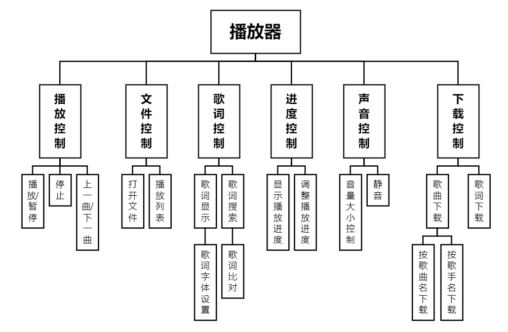

#### 系统概要设计说明书

概要设计说明书又可称系统设计说明书，这里所说的系统是指程序系统。编制的目的是说明对程序 系统的设计考虑，包括程序系统的基本处。流程、程序系统的组织结构、模块划分、功能分配、接口设计。 运行设计、数据结构设计和出错处理设计等，为程序的详细设计提供基础。编制概要设计说明书的内容 要求如下：

1. 引言

   1.1. 编写目的

      该概要设计说明书用于描述音乐播放器项目的整体系统设计方案，本说明书以“系统需求规格说明书”作为依据，本说明书是系统详细设计的依据，也为系统测试需求和系统测试计划和测试程序提供重要参考。本说明需求说明书面对的阅读对象为编写程序的工程师

   1.2. 背景

   1.3. 定义

   1.4. 参考资料

      软件项目需求分析报告

      软件需求规格说明

2. 总体设计

   2.1. 需求规定

      基本控制需求

      - 播放:点击播放列表中的歌曲进行播放，播放时跳转播放界面，并显示歌曲信息，同时会匹配歌词，把相应的歌词显示在歌词面板中。
      - 停止:当歌曲正在播放时，点击歌曲播放界面下方的停止键，停止当前播放的歌曲，同时歌词面板中的歌词清空。
      - 暂停:当歌曲正在播放时，点击歌曲播放界面下方的暂停键，暂停当前播放的歌曲，同时歌词停止滚动。
      - 上一曲:歌曲正在播放，点击上一曲键，播放列表中上一首歌曲。
      - 下一曲:歌曲正在播放，点击下一曲键，播放列表中下一首歌曲。
      - 播放列表:点击进入歌曲列表界面。

      扩展功能需求

      - 实现扫描识别本地音乐，方便用户广泛使用实现的音乐播放器；

      - 实现捕获/丢弃音乐焦点，当需要语音、视频或其他需要扬声器输出声音时，自动暂停，或者收到通知的时候音乐的音量变小随后恢复；

      - 实现硬件软件设备配合，实现耳机线控，并在耳机拔出或声音输出设备变换时暂停播放；

      - 实现在锁屏或者小窗控制播放器。

      友好使用需求

      - 视觉外观：使用播放器时，播放器根据歌曲文件的特性，通过视觉外观动态显示，外观优美。
      - 系统稳定：使用播放器时能显示播放器的状态，是播放还是暂停，播放音乐时稳定。
      - 后台：使用播放器时，能够进行后台播放，并且在手机桌面上显示缩小化的播放器，歌词滚动显示。
      - 播放模式：播放音乐时，更改播放模式能够顺利地、快速地、无差错地完成模式的转换。
      - 界面需求：播放器界面要求布局合理，颜色舒适，控制按钮友好；为了较少开发工程量，可以借鉴现在流行的播放器的皮肤作为播放器的界面目标需求。
      - 性能需求：播放器响应时间必须满足Android手机系统响应时间，因此当要求歌曲播放、暂停、停止、上一曲、下一曲、进入列表等操作时，软件响应时间最长均不超过系统无响应时间。
      - 数据库需求：Android自带的媒体库基于PacketVideo OpenCORE，该库支持多种常用的音频格式。编码格式MPEG4、MP3。音乐文件的解析:对于常用的音乐文件格式进行解析，如:Mp3格式。
      - 歌曲的存储:对于添加的歌曲进行存储，删除的歌曲进行移除。错误信息的存储:对于系统检查到的错误进行存储记忆。
      - 可靠性要求：系统能持续运行，不影响其他程序的使用，不多占用内存，不会造成死机等问题。

   2.2. 运行环境

      PC端：Windows 10 、有声卡、可联网

   2.3. 播放器基本功能的处理流程

      播放音乐的处理流程的顺序图

   

      歌单功能的流程的顺序图

      

      搜索功能的流程的顺序图

      

   

   2.4. 结构

   围绕查询与播放将本地播放器分为四个系统模块和三个数据库

   模块清单：

   | 编号 | 模块名称     | 模块标识   |
| ---- | ------------ | ---------- |
   | 1    | 界面模块     | Interface  |
| 2    | 播放系统模块 | PlayerMain |
   | 3    | 查询系统模块 | Search     |
   | 4    | 歌单系统模块 | List       |
   | 5    | 解码器模块   | Decode     |
   
   - Interface 界面模块：负责正确显示软件正在进行的操作，以及提供合适的控件
   
   数据库清单：

   | 编号 | 数据库名称   | 数据库标识     |
| ---- | ------------ | -------------- |
   | 1    | 本地数据库   | LocalDataBase  |
| 2    | 服务器数据库 | ServerDataBase |
   | 3    | 歌单数据库   | ListDataBase   |
   
   模块之间的结构如下
   
   

   2.5. 功能需求和程序的关系

   | 模块\功能    | 登录/注册 | 查看播放列表 | 上一曲/下一曲 | 显示/隐藏歌词 | 声音控制 | 下载歌曲 | 查询歌曲 |
| ------------ | --------- | ------------ | ------------- | ------------- | -------- | -------- | -------- |
   | 界面模块     | √         | √            | √             | √             | √        | √        | √        |
| 播放系统模块 | √         | √            | √             | √             | √        |          |          |
   | 查询系统模块 |           |              |               |               |          |          | √        |
   | 歌单系统模块 |           | √            |               |               |          | √        |          |
   
   2.6. 人工处理过程
   
   2.7. 尚未解决的问题

3. 接口设计

   3.1. 用户接口

   | 接口名称      | 接口调用   | 操作步骤                              | 接口描述           |
   | ------------- | ---------- | ------------------------------------- | ------------------ |
   | 注册/登录     | 鼠标、键盘 | 鼠标点击注册/登录按钮，键入账号信息   | 开始登陆操作       |
   | 查看播放列表  | 鼠标       | 鼠标点击播放列表                      | 跳转到播放列表页面 |
   | 上一曲/下一曲 | 鼠标       | 鼠标点击上一曲/下一曲                 | 播放下一曲/上一曲  |
   | 显示/隐藏歌词 | 鼠标       | 鼠标点击显示歌词按钮/再次点击隐藏歌词 | 显示歌词/隐藏歌词  |
   | 声音控制      | 鼠标       | 鼠标点击音量增/减按钮                 | 控制音量大小       |
   | 下载歌曲      | 鼠标       | 鼠标点击下载按钮                      | 下载该歌曲         |

   3.2. 外部接口

   - 操作系统界面显示 
   - 操作系统音频驱动
   - 网络访问

   3.3. 内部接口

   | 接口名称     | 接口调用 | 接口描述                                   |
   | ------------ | -------- | ------------------------------------------ |
   | 查询单曲     | 函数调用 | 给出查询的歌曲信息，返回服务器中对应的歌曲 |
   | 查询歌手     | 函数调用 | 给出查询的歌手信息，返回服务器中对应的歌曲 |
   | 查询歌词     | 函数调用 | 给出具体的歌曲，返回对应的歌词             |
   | 请求单曲     | 函数调用 | 给出具体的歌曲，返回对应的单曲文件         |
   | 声音控制     | 函数调用 | 给出具体的声音百分比参数，设置对应的大小   |
   | 调整播放进度 | 函数调用 | 给出具体歌曲中的具体位置，跳转到对应位置   |
   | 查询播放进度 | 函数调用 | 返回正在播放的歌曲中的具体位置             |
   | 查询歌单     | 函数调用 | 给出歌单名，返回歌单中的信息               |
   | 播放音频     | 函数调用 | 给出具体的歌曲文件，解码并播放对应的音乐   |
   | 暂停音频     | 函数调用 | 暂停播放音乐，并记录暂停位置               |

4. 运行设计

   最重要的播放系统主要划分为以下六个功能模块，每个功能模块的作用描述如下：

   

   ​	**播放控制**：控制歌曲的播放状态，如：播放、暂停、上一曲、下一曲。播放过的歌曲按播放顺序排列在播放列表中，每次退出程序、重启播放器后播放列表中的播放记录会自动保存不会清空。

      **文件控制**：主要用来打开本地播放文件。通过研究音频编码解码的相关技术,了解音频编码解码的原理和过程,本音乐播放器支持常见音频格式文件播放如:MP3、WMＡ、ＷAV等。可以单个曲目添加，也可以将整个文件夹中的曲目全部添加,实现歌曲文件添加的多样化；此外还可以对播放列表进行清空,对曲目的播放顺序进行控制；当播放列表中曲目过多时,可以从播放列表中快速搜索到需要播放的歌曲。还有对播放列表进行控制如:打开文件所在目录、移除列表、删除文件、显示歌曲文件的相关信息，如：歌手、专辑等.

      **歌词控制**：播放音乐时控制是否显示歌曲歌词,若歌词存在则同步滚动显示歌词,若歌词不存在则可联网下载歌词.此外还可以对歌词字体进行设置。

      **进度控制**:显示当前歌曲的播放总时长和已播放时长,可以通过鼠标调整歌曲的播放进度，实现歌曲的跳跃式播放。其实现方式是通过进度条和时间的同步显示。
   
      **声音控制**:调整歌曲音量的大小,显示是否静音。

      **下载控制**：可以联网下载自己喜欢的歌曲、歌词。若不知道歌曲名称则可以按歌手名查找歌曲下载,若知道歌曲名则可直接输入名称进行下载,可以在下载进度列表中查看下载状态. 

      4.1. 运行模块组合
   
   ​	说明对系统施加不同的外界运行控制时所引起的各种不同的运行模块组合 说明每种运行所历经的内部模块和支持软件
   
   |               | 播放控制 | 文件控制 | 歌词控制 | 进度控制 | 声音控制 | 下载控制 |  支持软件   |
   | :-----------: | :------: | :------: | :------: | :------: | :------: | :------: | :---------: |
   |   注册/登录   |          |    √     |          |          |          |          | windows系统 |
   | 查看播放列表  |    √     |          |          |          |          |          | windows系统 |
   | 上一曲/下一曲 |    √     |    √     |    √     |          |          |          | windows系统 |
   | 显示/隐藏歌词 |          |          |    √     |          |          |          | windows系统 |
   |   声音控制    |          |          |          |          |    √     |          | windows系统 |
   |   下载歌曲    |          |    √     |          |          |          |    √     | windows系统 |
   |   随机切歌    |    √     |    √     |          |    √     |          |          | windows系统 |
   |   暂停播放    |    √     |          |    √     |    √     |          |          | windows系统 |
   |  进度条控制   |    √     |          |          |    √     |          |          | windows系统 |
   
      4.2. 运行控制
   
    说明每一种外界的运行控制的方式方法和操作步骤  
   | 运行控制名称  | 控制方法   | 操作步骤                                 |
   | ------------- | ---------- | ---------------------------------------- |
   | 注册/登录     | 鼠标、键盘 | 鼠标点击注册/登录按钮，键入账号信息      |
   | 查看播放列表  | 鼠标       | 鼠标点击播放列表，跳转到播放列表页面     |
   | 上一曲/下一曲 | 鼠标       | 鼠标点击上一曲/下一曲                    |
   | 显示/隐藏歌词 | 鼠标       | 鼠标点击显示歌词按钮/再次点击隐藏歌词    |
   | 声音控制      | 鼠标       | 鼠标点击音量增/减按钮                    |
   | 下载歌曲      | 鼠标       | 鼠标点击下载按钮                         |
   | 随机切歌      | 鼠标       | 鼠标点击切歌按钮                         |
   | 暂停播放      | 鼠标/空格  | 鼠标点击播放/暂停按钮或按下空格键        |
   | 进度条控制    | 鼠标       | 鼠标点击进度条任意位置，跳转到指定时间点 |
   
   
   ​      
   
      4.3. 运行时间
      | 运行名称       | 所占资源                          | 时间                       |
      | -------------- | --------------------------------- | -------------------------- |
      | 选择歌曲       | 鼠标输入控制，部分内存和CPU资源   | 1~nS                       |
      | 播放歌曲       | 部分内存和CPU资源，以及播放器输出 | 随歌曲时间而定             |
      | 下载或传输歌曲 | 鼠标，部分内存和CPU资源           | 根据网络和文件传输速度而定 |
      | 进度条控制     | 鼠标，部分内存和CPU资源           | 立即反应                   |

​      

5. 系统数据结构设计

   | 结构名称:顺序结构 | 逻辑标识          | 物理标识            |
   | ----------------- | ----------------- | ------------------- |
   | 结构类型:树形     | 存储模式:顺序存储 | 存储介质:内存、磁盘 |

   | 访问模式:满足条件访问 | 读/写方式:按照顺序读写 |
   | --------------------- | ---------------------- |
   | 记录标识:无           | 记录长度:100           |

   

   5.1. 逻辑结构设计要点

      **树形结构**：

      使用B+树。

      数据元素之间为 **1:N** 的关系

      用户信息：

      | 字段名             | 数据类型 | 长度（字节） |
      | ------------------ | -------- | ------------ |
      | 用户名（用户昵称） | char     | 10           |
      | 用户ID             | int      | 15           |
      | 用户密码           | char     | 8            |
      | 性别               | char     | 2            |
      | 注册时间           | date     | 8            |
      | 用户其他信息       | Char     | 10           |

      歌曲库信息：

      | 字段名       | 数据类型 | 长度（字节） |
      | ------------ | -------- | ------------ |
      | 曲库名       | char     | 10           |
      | 曲库ID       | int      | 15           |
      | 曲库风格特点 | char     | 8            |
      | 库中歌曲数量 | int      | 3            |
      | 曲库位置     | char     | 10           |

      歌曲信息：

      | 字段名       | 数据类型 | 长度（字节） |
      | ------------ | -------- | ------------ |
      | 歌曲名       | char     | 10           |
      | 歌曲ID       | int      | 15           |
      | 歌手名       | char     | 8            |
      | 歌曲特点     | char     | 8            |
      | 歌手特点     | char     | 8            |
      | 歌曲储存位置 | char     | 10           |
      | 歌曲存储信息 | char     | 10           |

      播放记录信息：

      | 字段名       | 数据类型 | 长度（字节） |
      | ------------ | -------- | ------------ |
      | 曲库名       | char     | 10           |
      | 曲库ID       | int      | 15           |
      | 曲库风格特点 | char     | 8            |
      | 库中歌曲数量 | int      | 3            |
      | 曲库位置     | char     | 10           |

   5.2. 物理结构设计要点

      由客户端获得数据存入服务器，不同权限的操作人员有不同的访问方式。

      **顺序存储结构**
      把数据元素存放在地址连续的存储单元里，其数据间的逻辑关系和物理关系是一致的。
      数组就是以这种方式进行存储的。

   5.3. 数据结构与程序的关系

      数据机构为程序能够方便的使用和管理，以及使用时性能效果而服务。程序读取或存储数据结构中数据。

6. 系统出错处理设计

   6.1. 出错信息
   
      | 出错提示     | 原因                     | 解决办法                   |
      | ------------ | ------------------------ | -------------------------- |
      | 程序运行停止 | 手机内存不足或程序被中断 | 重启应用                   |
      | 手机内存不足 | 手机内存不足             | 清理手机内存               |
      | 找不到SD卡   | 没有文件路径             | 装载SD卡，重启             |
      | 音乐不能播放 | 文件损坏或播放路径不对   | 将音乐文件放在指定文件夹中 |
   
   6.2. 补救措施
   
      1.播放列表保存失败，可具有防御措施和恢复功能，可以恢复上一次登录时的播放列表。
   
      2.防止自动弹出，自动退出系统，保存上一次的播放进度。
   
      3.软件应捕获的错误，并采取的错误转移处理措施。
   
   6.3. 系统维护设计
   
      为了系统维护的方便而在程序内部设计中作出了安排，本软件是音乐播放软件，与手机内存相关联。在维护上只涉及到音乐更新问题，还有主题界面的更换。由于与手机内存相关联，所以在维护上不必花费太多资源。